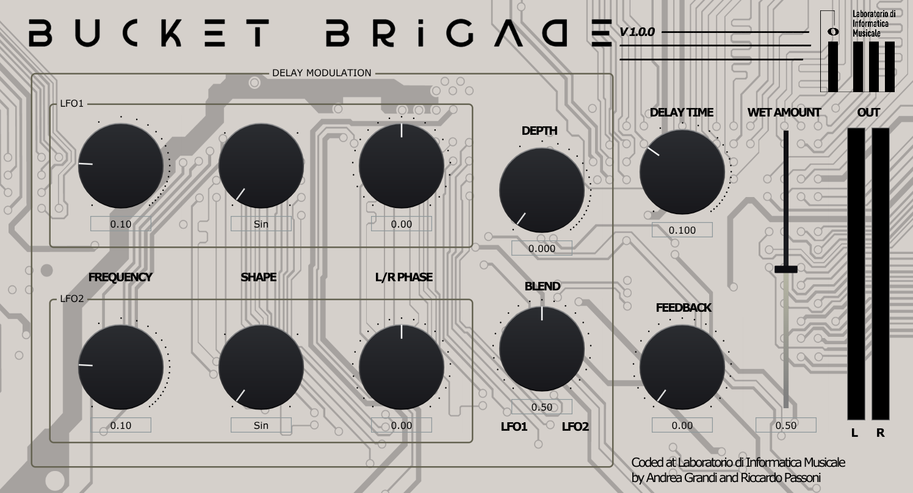

# Bucket Brigade - Analogue delay emulation
Emulation of the analogue bucket-brigade delay. Developed with the JUCE framework with @MotAtlas for the Music Production Technologies course @ University of Milan.

For more basic information on how bucket-brigade delay lines work: https://en.wikipedia.org/wiki/Bucket-brigade_device

For a more in depth look: https://www.researchgate.net/publication/327550964_A_Combined_Model_for_a_Bucket_Brigade_Device_and_its_Input_and_Output_Filters 

A block diagram is included in the "images" folder to showcase the basic function of each knob more intuitively. The two LFOs present in the plugin's interface respectively control the L and R stereo delay lines.

